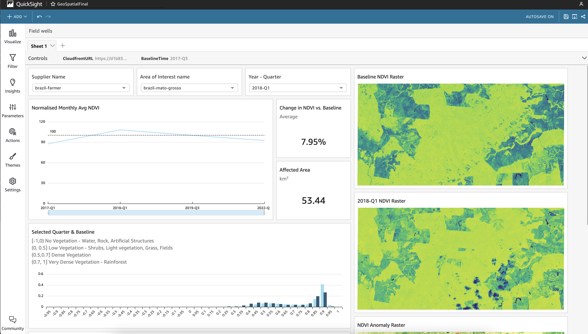
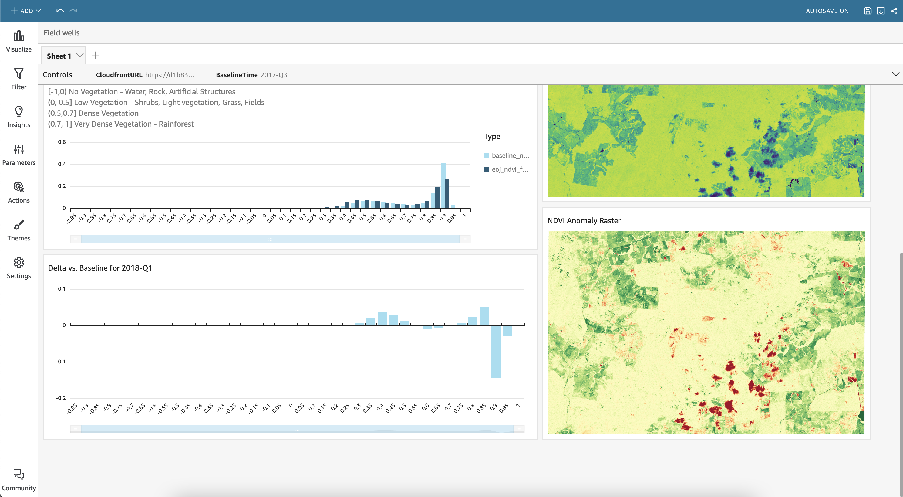
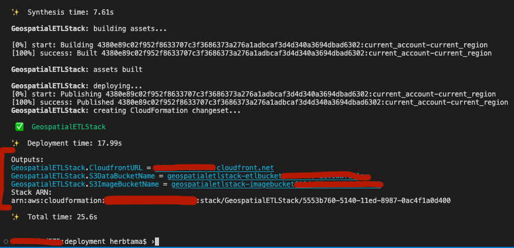
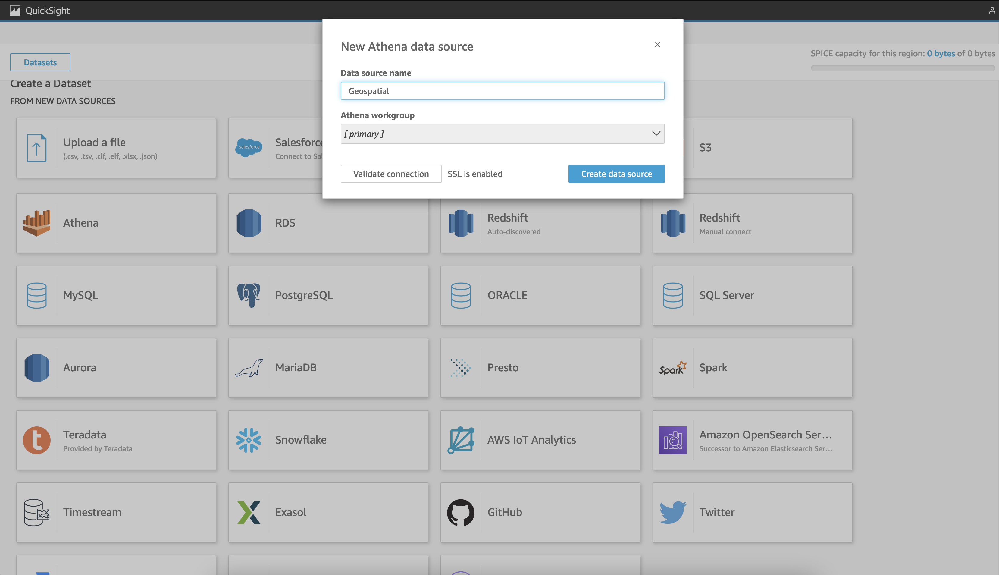
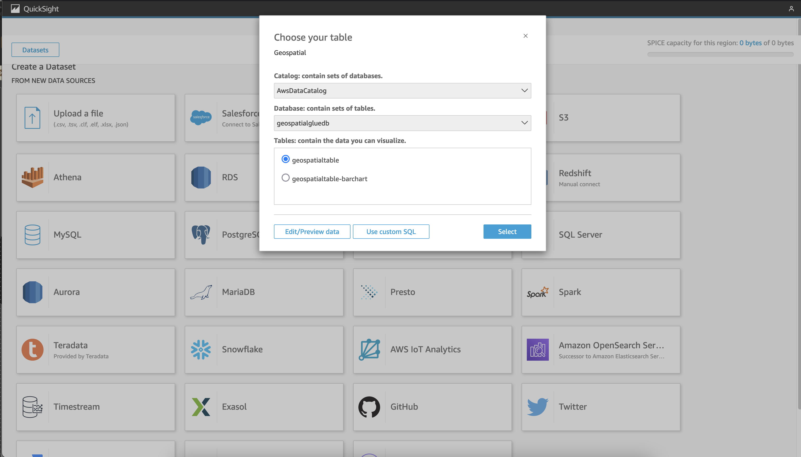
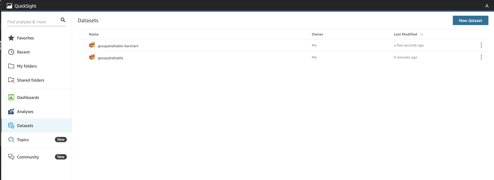
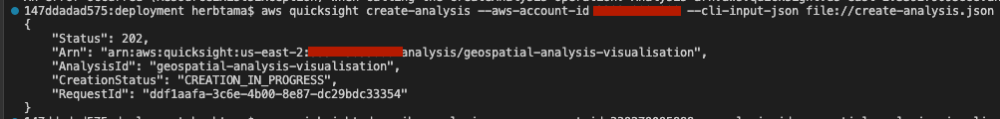
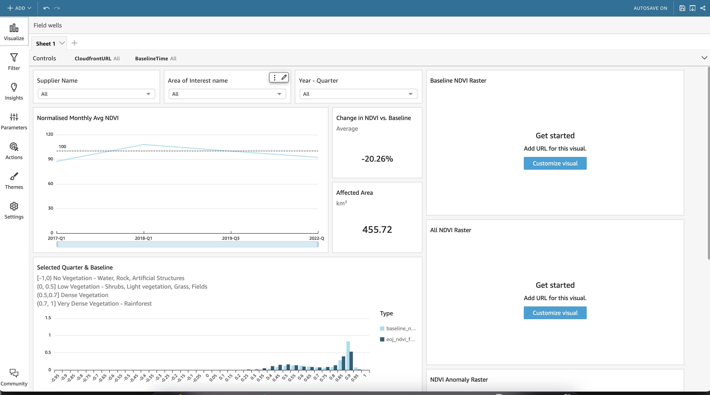
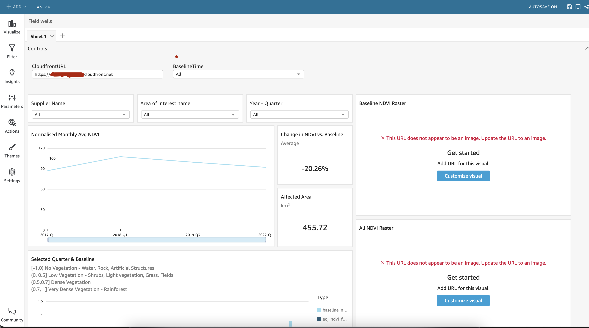
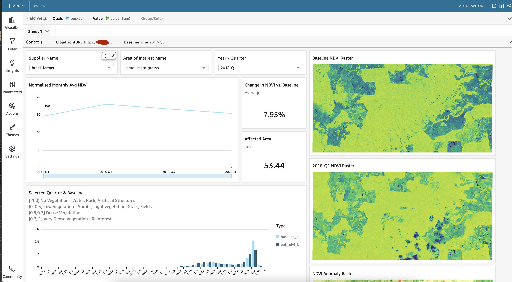

# Guidance for Geospatial Insights for Sustainability on AWS

## Introduction

In this solution, we demonstrate how you can leverage SageMaker's geospatial capabilities to baseline and monitor the vegetation type and density of the areas where suppliers operate. This is useful because it allows users to track changes in forest density. For example, if a business uses palm oil in their products, they likely want to ensure that the palm oil was sourced responsibly, and that natural forests were not burned down and cleared to make way for a palm oil plantation. The same applies to other key raw materials such as rubber, soy or timber. It is difficult to observe these changes, because suppliers are often geographically far from customers and may often be situated several steps away in the supply chain.

Typical land use classification and vegetation data have long refresh cycles which make them unsuitable for monitoring supply chain origins, where customers need to know much sooner if their suppliers have deviated from agreed terms. On the other hand, creating a solution which classifies vegetation requires high manual effort to retrieve the adequate satellite imagery for the area of interest, and to process the raw satellite data (possibly training and applying land use classification algorithms).

SageMaker's geospatial capabilities remove this effort, by providing the data sets and the necessary algorithms to make land use classification and vegetation mapping easier and faster. Drawing on high-resolution satellite imagery from the [Landsat](https://registry.opendata.aws/usgs-landsat/) and [Sentinel 2](https://registry.opendata.aws/sentinel-2-l2a-cogs/) constellations, SageMaker geospatial functionalities provide a straight-forward querying tool for retrieving satellite imagery for a desired area of interest (AOI), period and for given conditions (e.g., limit on cloud cover) and offers a wealth of built-in image processing capabilities.

As with any other SageMaker-native solutions, SageMaker geospatial capabilities readily integrate with existing AWS tooling. As part of this Guidance, we provide an Amazon QuickSight template, which enables you to visualize and query.

## Case

To demonstrate how this solution works end-to-end, we will use a randomly selected AOI from Brazil. However, this solution readily generalizes to any other desired AOI.

Illegal land clearing, primarily for cattle production, oilseed growing (soybean and palm oil) and timber harvesting, is a major concern in [Brazil](https://en.wikipedia.org/wiki/Deforestation_in_Brazil). Local rainforests are at a sever risk of complete destruction. Similar issues exist in other tropical domains such as [Indonesia](https://en.wikipedia.org/wiki/Deforestation_in_Indonesia), [DR Congo](https://en.wikipedia.org/wiki/Deforestation_in_the_Democratic_Republic_of_the_Congo) or [Malyasia](https://en.wikipedia.org/wiki/Deforestation_in_Malaysia) just to name a few. With many global supply chains relying heavily on products such as palm oil or soybean that are often produced in far-away geographies, remote monitoring of origins and producers becomes crucial from a social responsibility standpoint.


## Architecture & Solution Overview

We use SageMaker geospatial functionalities which simplify the process of retrieving and analyzing satellite images for changes in vegetation. The results of that analysis are stored in S3 where they are then cataloged and subsequently observable in QuickSight so that procurement and sustainability teams can review supplier location vegetation changes over time in one place. You can find a more detailed description of the architecture [here](TODO:link).

### Normalized Difference Vegetation Index (NDVI) as measure for vegetation density
We rely on [Normalized Difference Vegetation Index (NDVI)](https://en.wikipedia.org/wiki/Normalized_difference_vegetation_index#:~:text=The%20normalized%20difference%20vegetation%20index,observed%20contains%20live%20green%20vegetation) as measure for vegetation density and land cover class. NDVI repesents a common approach for surveying biomes (see e.g., [Fractional vegetation cover from Sentinel-2](https://sentinel.esa.int/web/success-stories/-/fractional-vegetation-cover-from-sentinel-2) use case). NDVI is computed by combining the red (visible) and near-infrared (NIR) bands of the retrieved satellite imagery into a single index ranging from -1 to 1. SageMaker geospatial has built-in NDVI calculation functionality that automates this process.

Negative values of NDVI (values approaching -1) correspond to water. Values close to zero (-0.1 to 0.1) generally correspond to barren areas of rock, sand, or snow. Lastly, low, positive values represent shrub and grassland (approximately 0.2 to 0.4), while high values indicate temperate and tropical rainforests (values approaching 1). We use the following map to relate NDVI values to their corresponding vegetation class:

```
NDVI_map={
          (-1,0]: "no vegetation (water, rock, artificial structures)",
          (0,0.5]:"light vegetation (shrubs, grass, fields)",
          (0.5,0.7]:"dense vegetation (forests, plantations)",
          (0.7,1]:"very dense vegetation (rainforest)"}
```

The Table below shows NDVI-transformed satellite imagery for the AOI in scope. Bright yellow patches (NDVI=1) represent rainforest that is intact, darker patches represent fields (0.5>NDVI>0), while dark-blue patches represent water (NDVI=-1). By comparing current period values vs. a defined baseline period, changes and anomalies in NDVI can be identified and tracked over time. For the example below, you can clearly see how the large patch of rainforest in the center of the image (bright yellow) is successively turned into farmland (darker patches).

|__2017 (Q3)__|__2018 (Q3)__|__2019 (Q3)__|
| :---         |     :---:      |          ---: |
| | | |

|__2020 (Q3)__|__2021 (Q3)__|__2022 (Q3)__|
| :---         |     :---:      |          ---: |
| | | |


### Dashboard Outline
The QuickSight Dashboard template (see screenshot below) offers three core visualization components:
1. __Time series plot of NDVI values normalized against the baseline period__
1. __Full discrete distribution of NDVI values in the baseline period and the current period__
1. __NDVI-transformed satellite imagery for the baseline period, current period and pixel-by-pixel differences between both periods__





These visualizations offer early warning functionality and provide transparency on the following questions:

* __When and over what period did deforestation occur?__: With Sentinel 2 satellite imagery available from as early as mid-2017, the solution allows you to pinpoint when a new deforestation event occurred as well as monitor its duration, its progression and/or its possible recovery (such tree re-growth). The maximum temporal resolution of this solution is 5 days (this is how often Sentinel 2 passes over the same point), though other factors like cloud coverage in a specific area can also influence the temporal granularity of the assessments. The provided time series view also allows you to identify naturally occurring fluctuations in vegetation (e.g., due to seasonal variations) and clearly distinguish them from man-made phenomena.
* __Which type of land cover was most affected?__: The full distribution of NDVI values across the AOI for the baseline period and the current period are presented and compared in an easy-to-read bar chart. This makes it easy to identify which NDVI bin exhibit the largest anomaly and to pinpoint which land cover classes were most affected (e.g., tropical forests or shrub).
* __Where specifically did deforestation occur?__: Pixel-by-pixel comparison between baseline and current satellite imagery (before vs. after) allow you to identify the precise locations where deforestation has occurred. The dashboard automatically loads this imagery based on the selected filters.
* __How much forest was cleared?__: An estimate on the affected area (in km2) is provided taking advantage of the fine-grained resolution of Sentinel imagery (10mx10m).

## Prerequisities & Deployment

This demo requires [Amazon Quicksight](https://aws.amazon.com/quicksight/) to be enabled in your AWS account with [Enterprise Edition](https://aws.amazon.com/quicksight/pricing/). You also need the [Amazon Command Line Interface (CLI)](https://docs.aws.amazon.com/cli/latest/userguide/cli-chap-getting-started.html) and the [AWS Cloud Development Kit (CDK)](https://docs.aws.amazon.com/cdk/v2/guide/getting_started.html#getting_started_prerequisites) installed on your machine.  Your AWS account must be [bootstrapped for CDK](https://docs.aws.amazon.com/cdk/v2/guide/bootstrapping.html).

This demo assumes resources deployed in the `us-west-2` (Oregon) region.

1. __Deploy Base Infrastructure using CDK__
* Clone this repository to your local machine
* In your Terminal, navigate to the repository folder on your machine (run `cd <path to repository> `)
* With [CLI credentials for your AWS account](https://docs.aws.amazon.com/cli/latest/userguide/cli-chap-configure.html), run  `cd deployment && cdk deploy`
* Wait until the `GeospatialETLStack` been marked as `CREATE COMPLETE` in the [Cloudformation Console](https://us-west-2.console.aws.amazon.com/cloudformation/)
* Take note of the 3 Output Values for the Cloudfront distribution & the two S3 bucket names



2. __Set up SageMaker's Geospatial Capabilities__

A detailed step-by-step guide is provided in the [Getting Started Guide](https://docs.aws.amazon.com/sagemaker/latest/dg/geospatial-getting-started.html). In summary, the following prerequisites need to be satisfied to use SageMaker geospatial capabilities.
* Create a [SageMaker Domain](https://docs.aws.amazon.com/sagemaker/latest/dg/onboard-quick-start.html) in region `us-west-2` (Oregon) (skip if you already have a Domain in `us-west-2`)
* In your AWS Console, navigate to the previously created SageMaker Domain in `us-west-2`.
* [Clone](https://docs.aws.amazon.com/sagemaker/latest/dg/studio-tasks-git.html) this repository to the root folder of the SageMaker Studio User.
* Launch `SageMaker-geospatial-notebook.ipynb` located in the `/deployment/` folder.
* Select `Geospatial 1.0` as the Image for your Notebook environment.
* Select a sufficiently-sized instance type. Operations on satellite raster imagery can be very memory-intensive. The recommended default instance to go with the `Geospatial 1.0` image is an `ml.m5.4xlarge`. Do not select a different instance type. Make sure to use [Lifecycle policies](https://aws.amazon.com/blogs/machine-learning/customize-amazon-sagemaker-studio-using-lifecycle-configurations/) to shut down the instance when not in use to avoid uncecessary cost.
* Set Appropriate Permissions and Trust Policies on the SageMaker Execution Role used for your analysis. A detailed description of the [required in-line policy changes required is provided in the Developer Guidelines](https://docs.aws.amazon.com/sagemaker/latest/dg/sagemaker-geospatial-roles.html). Set the permissions on the Execution Role accordingly using AWS Identity and Access Management.
* Follow the instructions provided in the Notebook (`SageMaker-geospatial-notebook.ipynb`) to perform Earth Observation Jobs (EOJ) for an area of observation (AOI) of choice.

      > ⚠️ **Warning!** To ensure all output data will be saved to the designated S3 output buckets created in the previous infrastructure deployment step, make sure to set the respective bucket name variables accordingly, i.e., `main_bucket_name = geospatialstack-etlbucket<...>` and `img_bucket_name = geospatialstack-imagebucket<...>` (see also the respective instuctions in the notebook).
      > For illustrative purposes and easier readability, the notebook is currently set up to generate data for a baseline period (2017-Q3) and a single in-scope period (2022-Q3). However, you can easily extend the notebook to generate a full history of EOJs by looping over the full set of periods that lie between the baseline period and the in-scope period. We provide further instructions on how to implement such a simple loop in the notebook. Alternatively you can choose to use the pre-generated sample data in the `/assets/processed-eoj-output/` folder which contains results for quarterly EOJs from 2017 through 2022 for the sample AOI in Brazil.

3. __Configure Quicksight Dashboard__

* Now that you have your data in the relevant S3 buckets, lets visualise it!

      > ⚠️ **Warning!** Make sure that you have Amazon Quicksight Enterprise Edition enabled in your account to follow the next steps.

* Please ensure that Amazon Quicksight has permissions to access the S3 ETL Bucket, with Athena also allowed. This can be done in the console, in the Quicksight service settings. This is under Security & permissions settings, under "Manage Quicksight".
* Once it is done, lets import our datasets into Quicksight. Click on "Datasets" on the left hand side of the page, and select "New dataset"
* Select "Athena", type in a DataSource name, and then continue with "Create data source"
    

*  We'll want to import both of these tables, first, lets import the `geospatialtable`. We dont need to import this data to SPICE, so select the option to "Directly query your data"
    

* An analysis will appear- but we're not done yet! Click on the quicksight logo in the top left hand side of the page, and reimport the other dataset as well.
* Your dataset tab in Amazon Quicksight should now look like the below:
    

* We now want to stand up our new analysis from a pre-made template. In the deployment directory of this repo, open up the `create-analysis.json` file- we'll need to update it.
* In your CLI, we want to get the ID's of those two datasets we've just created. You can get these by running `aws quicksight list-data-sets --aws-account-id <YOUR ACCOUNT ID>`
* Copy and paste the data set ID's into the create-analysis.json file into the specific gaps left for them highlighted with `<DATASET ID>` and `<BARCHART DATASET ID>`. Also fill in the gaps highlighted for `<ACCOUNT ID>`. You can find your `<YOUR QUICKSIGHT USER>` at the top right hand corner of the Quicksight dashboard homepage. Its important to note that whatever region you deployed in, the quicksight user ARN will always be in `us-east-1`.
* In the `/deployment` directory, run the following:

      ```
      aws quicksight create-analysis --aws-account-id <ACCOUNT ID> --cli-input-json file://create-analysis.json
      ```

   

* You should now see the new analysis in your Quicksight Console Dashboard. Click on it, and you'll see the following:
   

* Almost there! Using the cloudfront URL which was the output of the cdk stack we deployed, update the CloudfrontURL Control at the top of the analysis, prefixing `https://` as follows:
   

* Finally, configure your parameters! Select the baseline that you'd like to compare against in the `BaselineTime` control, select the `Supplier Name`, `Area of Interest name` and the `Year - Quarter` that you'd like to investigate, and the data will load in automatically as follows:
   
